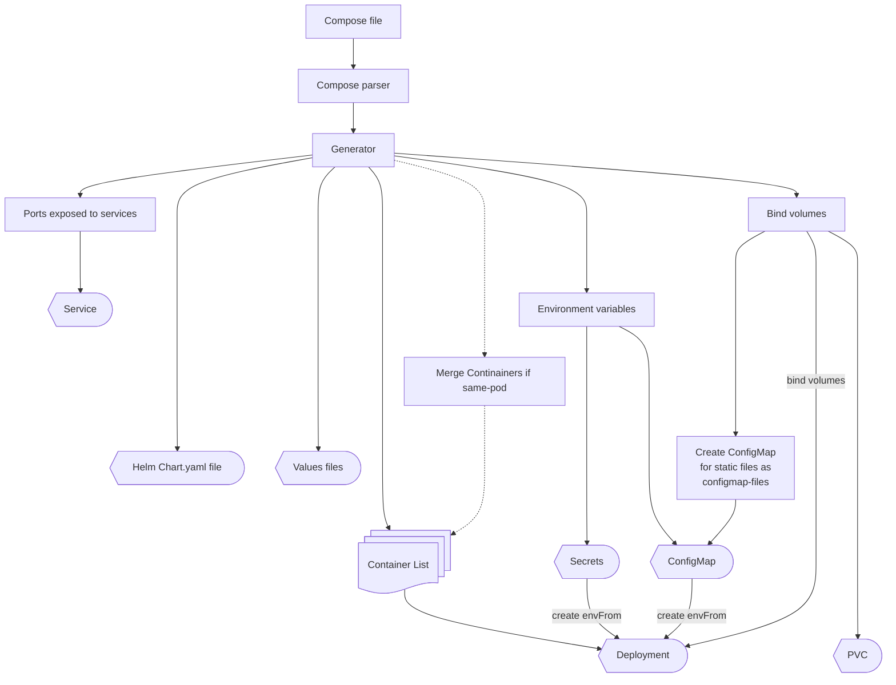

# How Katenary works behind the scene

This section is for developers who want to take part in Katenary. Here we describe how it works and the expected
principles.

## A few important points

Katenary is developed in Go. The version currently supported is 1.20. For reasons of readability, the `any` type is
preferred to `interface{}`.

Since version v3, Katenary uses, in addition to `go-compose`, the `k8s` library to generate objects that are guaranteed
to work before transformation. Katenary adds Helm syntax entries to add loops, transformations, and conditions.

We really try to follow best practices and code principles. But, Katenary needs a lot of workarounds and string
manipulation during the process. There are, also, some drawbacks using standard k8s packages that make a lot of type
checks when generating the objects. We need to finalize the values after object generation.

**This makes the coding a bit harder than simply converting from YAML to YAML.**

> If Katenary only generated YAML objects, the algorithms would be much simpler and would require less generation work.

## General principle

During conversion, the `generator` package is primarily responsible for creating "objects". The principle is to generate
one `Deployment` per `compose` service. If the container coming from "compose" exposes ports (explicitly), then a
service is created.



If the declaration of a container is to be integrated into another pod (via the `same-pod` label), this `Deployment` and
its associated service are still created. They are deleted last, once the merge has been completed.

## Conversion in "`generator`" package

The `generator` package is where object struct are defined, and where you can find the `Generate()` function.

The generation fills `HelmChart` object using a loop:

```golang
for _, service := range project.Services {
    dep := NewDeployment(service)
    y, _ := dep.Yaml()
    chart.Templates[dep.Filename()] = &ChartTemplate{
        Content: y,
        Servicename: service.Name,
    }
}
```

**A lot** of string manipulations are made by each `Yaml()` methods. This is where you find the complex and impacting
operations. The `Yaml` methods **don't return a valid YAML content**. This is a Helm Chart YAML content with template
conditions, values and calls to helper templates.

> The `Yaml()` methods, in each object, need contribution, help, fixes, enhancements... They work, but there is a lot of
> complexity. Please, create issues, pull-requests and conversation in the GitHub repository.

The final step, before sending all templates to chart, is to bind the containers inside the same pod where it's
specified.

For each source container linked to the destination:

- we get the deployment of the source
- we copy the container to the destination deployment
- we get the associated service (if any)
- we then copy the service port to the destination service
- we finally remove the source service and deployment

> The `Configmap`, secrets, variables... are kept.

It finally computes the `helper` file.

## Conversion command

The `generator` works the same as described above. But the "convert" command makes some final steps:

- generate `values.yaml` and `Chart.yaml` files from the `HelmChart` object
- add comments to the `values.yaml` files
- add comments to the `Chart.yaml` files
