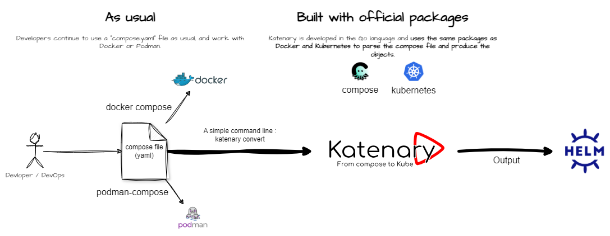

<div class="md-center" id="logo"></div>

# Welcome to Katenary documentation

🚀 Unleash Productivity with Katenary! 🚀

Tired of manual conversions? Katenary harnesses the labels from your "compose" file to craft complete Helm Charts 
effortlessly, saving you time and energy.

🛠️ Simple autmated CLI: Katenary handles the grunt work, generating everything needed for seamless service binding 
and Helm Chart creation.

💡 Effortless Efficiency: You only need to add labels when it's necessary to precise things. Then call `katenary convert`
and let the magic happen.

<div style="margin: auto" class="zoomable">
  
</div>


# What is it?

Katenary is a tool made to help you to transform "compose" files (`docker-compose.yml`, `podman-compose.yml`...) to
complete and production ready [Helm Chart](https://helm.sh).

You'll be able to deploy your project in [:material-kubernetes: Kubernetes](https://kubernetes.io) in a few seconds 
(of course, more if you need to tweak with labels).

It uses your current file and optionnaly labels to configure the result.

It's an opensource project, under MIT licence, partially developped at [Smile](https://www.smile.eu). The project source 
code is hosted on the [:fontawesome-brands-github: Katenary GitHub Repository](https://github.com/metal3d/katenary).

## Install Katenary

Katenary is developped using the :fontawesome-brands-golang:{ .gopher } [Go](https://go.dev) language. 
The binary is statically linked, so you can simply download it from the [release
page](https://github.com/metal3d/katenary/releases) of the project in GutHub.

You need to select the right binary for your operating system and architecture, and copy the binary in a directory 
that is in your `PATH`.

If you are a Linux user, you can use the "one line installation command" which will download the binary in your 
`$HOME/.local/bin` directory if it exists.

```bash
sh <(curl -sSL https://raw.githubusercontent.com/metal3d/katenary/master/install.sh)
```

!!! Info "Upgrading is integrated to the `katenary` command"
    Katenary propose a `upgrade` subcommand to update the current binary to the latest stable release.

    Of course, you need to install Katenary once :smile:


!!! Note "You prefer to compile it, no need to install Go"
    You can also build and install it yourself, the provided Makefile has got a `build` command that uses `podman` or 
    `docker` to build the binary. 

    So, you don't need to install Go compiler :+1:.

    But, note that the "master" branch is not the "stable" version. It's preferable to switch to a tag, or to use the
    releases.

To compile it, you can use the following commands:

```bash
git clone https://github.com/metal3d/katenary.git
cd katenary
make build
make install
```

`make install` copies `./katenary` binary to your user binary path (`~/.local/bin`) 

You can install it in other directory by changing the `PREFIX` variable. E.g.:

```bash
make build
sudo make install PREFIX=/usr/local
```

Check if everything is OK using `katenary version` and / or `katenary help`

## Install completion

Katenary uses the very nice project named `cobra` to manage flags, argument and auto-completion.

You can activate it with:

```bash
# replace "bash" by "zsh" if needed
source <(katenary completion bash)
```

Add this line in you `~/.profile`, `~/.bash_aliases` or `~/.bashrc` file to have completion at startup.


## What a name...

A catenary is the curve that a hanging chain or cable assumes under its own weight when supported only at its ends.
I, the maintainer, decided to name "Katenary" this project because it's like a chain that links a boat to a dock.
Making the link between the "compose" world and the "Kubernetes" world is the main goal of this project.

Anyway, it's too late to change the name now :smile:

!!! Note "But I like this name!"

    I spent time to find it :wink:

## Special thanks to...

I really want to thank all the contributors, testers, and of course, the authors of the packages and tools that are used
in this project. There is too many to list here. Katenary can works because of all these people. Open source is a great
thing! :heart:


!!! Edit "Special thanks" 

    **Katenary is built with:** <br /> 

    <a href="https://go.dev" target="_blank">:fontawesome-brands-golang:{ .go-logo }</a> 

    Go is an open source programming language that makes it easy to build simple, reliable, and efficient software. Because Docker, Podman,
    Kubernetes, and Helm are written in Go, Katenary is also written in Go and borrows packages from these projects to
    make it as efficient as possible.

    Thanks to Kubernetes to provide [Kind](https://kind.sigs.k8s.io) that is used to test Katenary locally.

    **Thanks to everyone who contributes to all these projects.**

    Katenary can progress because of all these people. All contributions, as comments, issues, pull requests and
    feedbacks are welcome.

    **Everything was also possible because of:** <br /> 

    <ul>
      <li><a href="https://helm.sh" target="_blank">
      Helm</a> that is the main toppic of Katenary, Kubernetes is easier to use with it.</li> 
      <li><a href="https://cobra.dev/"> Cobra</a> that
      makes command, subcommand and completion possible for Katenary with ease.</li>
      <li>Podman, Docker, Kubernetes that are the main tools that Katenary is made for.</li>
    </ul>

    **Documentation is built with:** <br /> 

    <a href="https://www.mkdocs.org/" target="_blank">MkDocs</a> using <a
    href="https://squidfunk.github.io/mkdocs-material/" target="_blank">Material for MkDocs</a> theme template.

## License

Katenary is an open source project under the MIT license. You can use it, modify it, and distribute it as you want.
